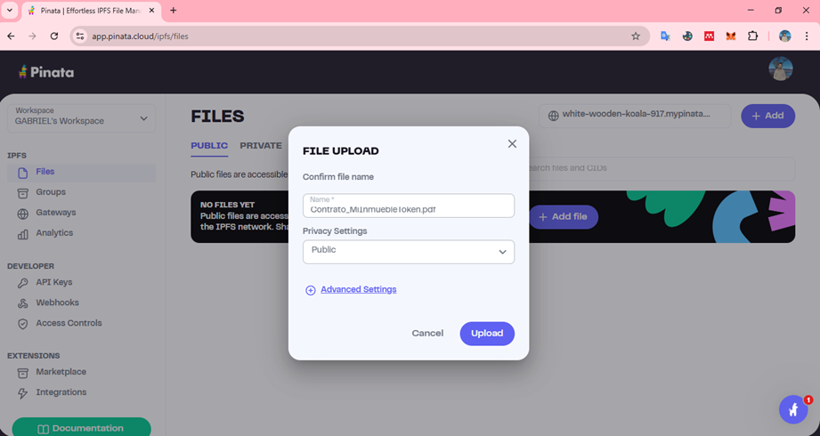
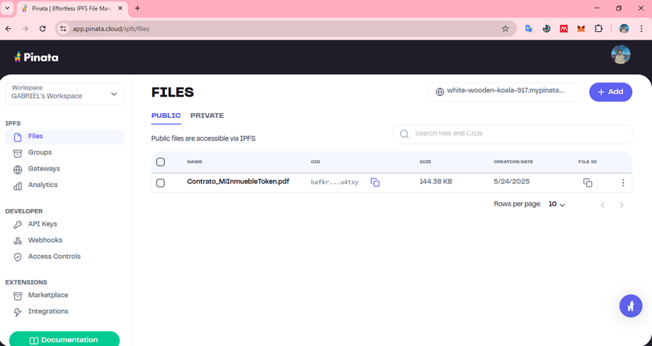
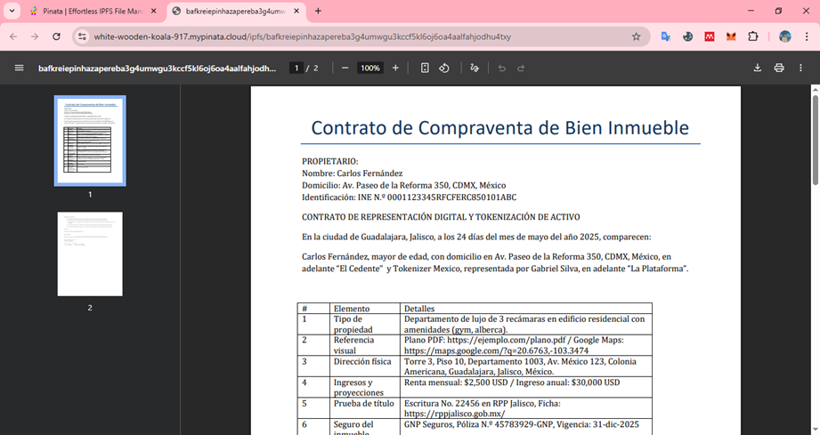

# Definir el contrato de inmueble a tokenizar

Lineamientos Legales en México
1. El activo debe estar registrado y ser legalmente transferible.
2. El contrato debe estipular la naturaleza del token (fungible o no fungible).
3. Se debe cumplir con la Ley para Regular las Instituciones de Tecnología Financiera (Ley Fintech).
4. En caso de representar valores (acciones, deuda), se deben atender las disposiciones de la Comisión Nacional Bancaria y de Valores (CNBV).

## Ley Fintech Mexicana (Resúmen Cláusulas Relevantes)
- Artículo 3: Define los activos virtuales y su tratamiento legal.
- Artículo 30: Las Instituciones de Tecnología Financiera deben establecer mecanismos de verificación y validación de identidad.
- Artículo 44: Las ITF que operen con activos virtuales deberán contar con autorización de la CNBV y aplicar medidas de prevención de lavado de dinero.
Referencia oficial: [LRITF](https://www.diputados.gob.mx/LeyesBiblio/pdf/LRITF.pdf)

## Recomendaciones Técnicas
- Subir el contrato firmado a IPFS
- Insertar el hash en el contrato inteligente (contractHash)
- Establecer límites de transferencia si representa propiedad compartida
- Proteger el contrato con control de acceso (Ownable o AccessControl en Solidity)

## Descripción del activo a tokenizar

1) Breve explicación del tipo de propiedad: ejemplo: departamento
2) Referencia visual: Enlace al plano de la propiedad, imágenes, o incluso un link a Google Maps para comprobar su existencia física y dimensiones.
3) Dirección física: La ubicación exacta y verificable del inmueble.
4) Ingresos y proyecciones: Monto de renta mensual o anual estimado, para que los potenciales compradores o inversionistas conozcan la rentabilidad.
5) Prueba de título: Documento que certifica la propiedad, como la escritura o el registro público, con número de registro y/o enlace al organismo oficial correspondiente.
6) Seguro del inmueble: Comprobante del seguro vigente, incluyendo nombre de la compañía aseguradora y número de póliza, para mitigar riesgos.
7) Datos del propietario: Nombre(s) y dirección del o los titulares actuales del inmueble, pudiendo incluir también enlaces a perfiles públicos (LinkedIn, web oficial, etc.) para dar transparencia y confianza.
8) Precio de compra original y valor actual: Incluye la fecha de compra, el precio inicial y una tasación reciente o certificado de valor actual, con enlaces o documentos adjuntos.
9) Acuerdo de compra-venta: Contrato legal que respalda la compra del activo, preferentemente con acceso a una copia digital o link.
10) Certificado notarial: Enlace a un documento notarizado que autentica la información proporcionada en el contrato.
11) Nombre y características del token: Elige un nombre único para tu token (ejemplo MyRealToken), especifica qué porcentaje o valor representa cada token, y establece el precio inicial estimado.
12) Total de tokens emitidos.
13) Derechos adicionales: "no aplicable".
14) Fecha de creación del contrato y firma electrónica del responsable legal.

## Subir el contrato firmado a IPFS

Ingresamos a [Pinata](https://app.pinata.cloud/) para subir nuestro contrato a la red descentralizada mediante IPFS. 

Una vez cargado, la plataforma nos proporciona el CID de este documento:

>**CID:**  bafkreiepinhazapereba3g4umwgu3kccf5kl6oj6oa4aalfahjodhu4txy**

Al consultarlo a través del gateway de **PINATA** podemos ver el contrato:

https://gateway.pinata.cloud/ipfs/bafkreiepinhazapereba3g4umwgu3kccf5kl6oj6oa4aalfahjodhu4txy

