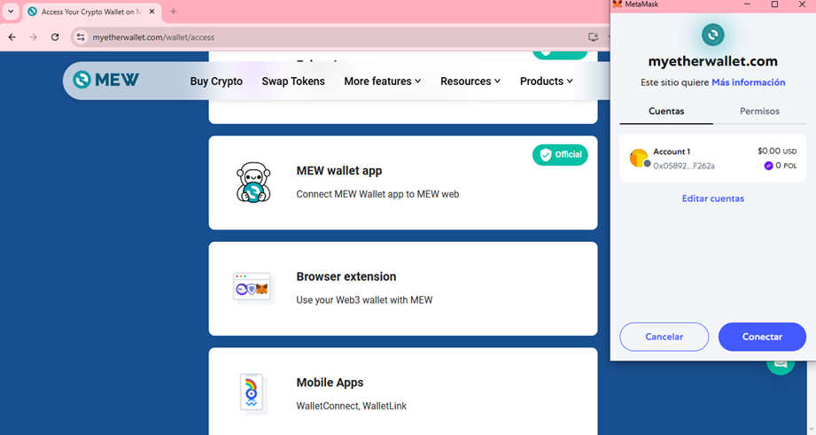
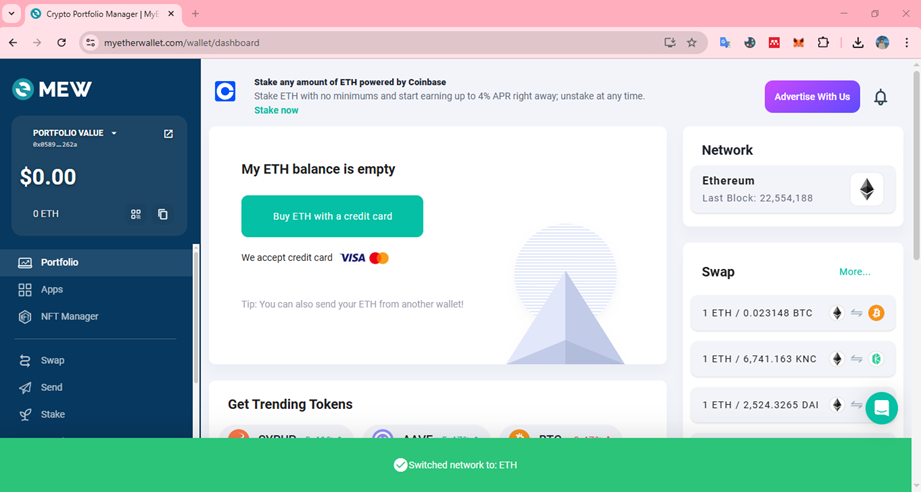
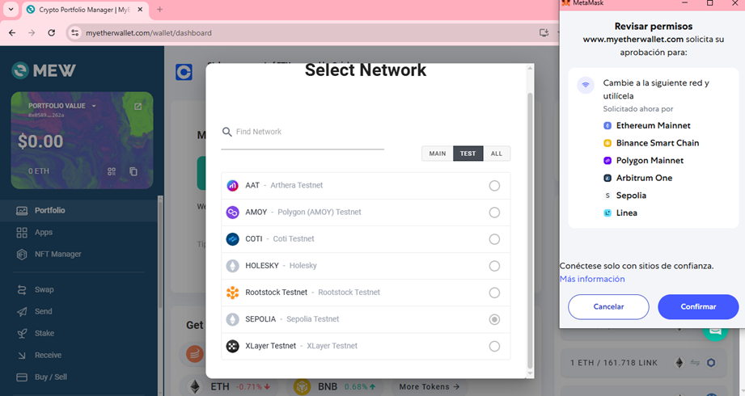
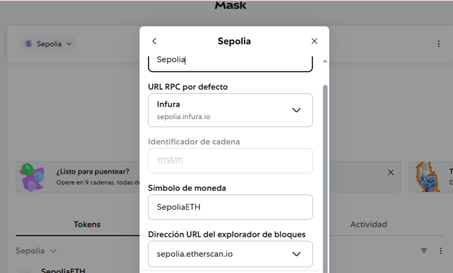

# Creación de cartera Ethereum

**MyEtherWallet (MEW)** es una de las carteras (wallets) más populares y veteranas del ecosistema Ethereum.
Permite a los usuarios crear, gestionar y utilizar billeteras Ethereum de forma sencilla, directa y sin custodio (es decir, tú controlas tus llaves privadas).

>**Sitio oficial: [https://www.myetherwallet.com/](https://www.myetherwallet.com/)**

Ingresamos al sitio y nos conectamos con Metamask mediante la extensión para el navegador.

Una vez conectados estaremos en la red de Ethereum y nos mostrará nuestro monto que tenemos en la wallet.

Cambiamos de red y escogemos las redes de prueba (**TEST**), y seleccionamos la de **SEPOLIA**. Confirmamos los permisos para conectarnos a través de Metamask.

Agregar la red de prueba SEPOLIA a MetaMask es esencial para interactuar con contratos y tokens en esta testnet.  

Si no tenemos en Metamask dentro de la lista de redes a SEPOLIA, la agregamos a nuestra lista:

***
- Network Name: **Sepolia**
- New RPC URL: https://sepolia.infura.io
- Chain ID: **11155111**
- Currency Symbol: **SepoliaETH**
- Block Explorer URL: https://sepolia.etherscan.io/
***

