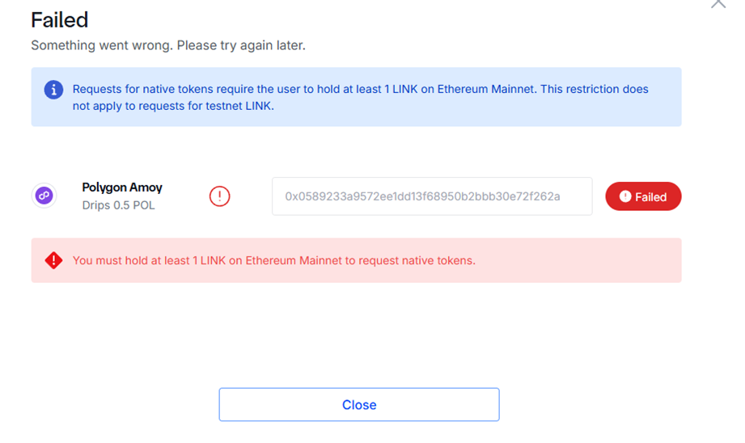
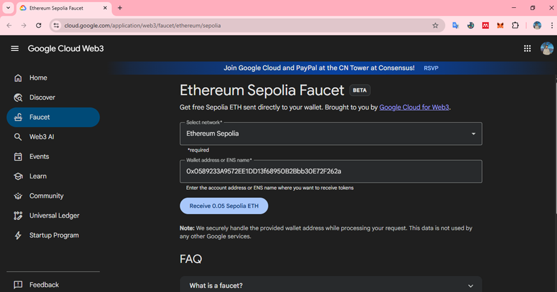
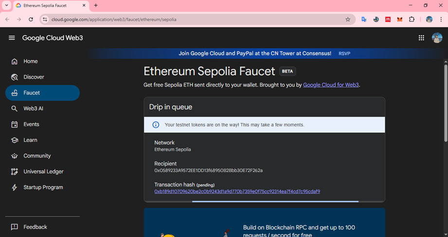
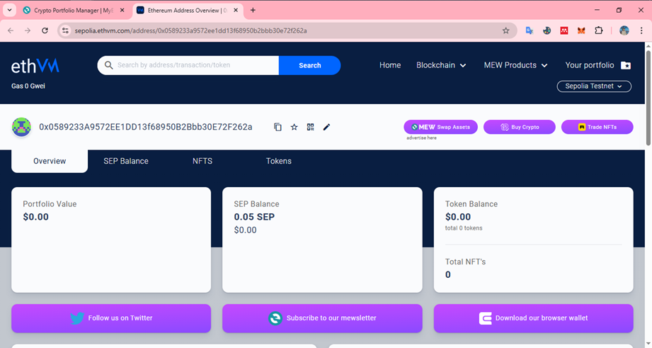
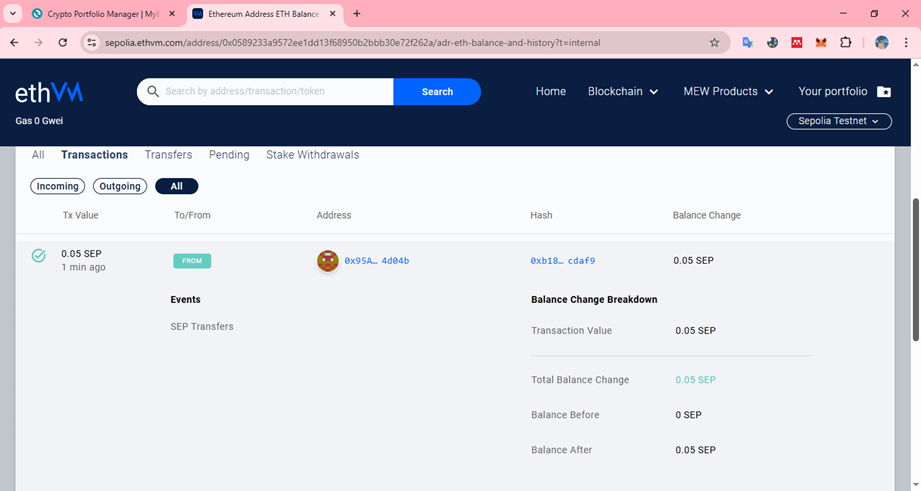

# Solicitar SEP de prueba en la red SEPOLIA usando la faucet

La mayoría de las faucet, tanto para redes de prueba de Amoy o Sepolia es necesario contar con al menos **0.001 POL** o **0.01 ETH** en la red principal (Polygon Mainnet o Ethereum), ya que la faucet exige este saldo mínimo para evitar el abuso y garantizar que solo usuarios reales puedan recibir tokens de prueba.

En la siguiente imagen nos envía el error debido a que necesitamos un saldo mínimo para verificar que no vamos a abusar de la red y debido a que el saldo esta en 0.00 no puedo recibir tokens de prueba.

Para el caso de que no quieras ingresar dinero FIAT y adquirir ETH o POL para obtener tokens de prueba, podemos  ingresar a la **Web3 Faucet de Google** para obtener tokens gratis sin tener saldo en tu billetera (0.00). El único requisito es que debes de conectar a tu cuenta de Google y tener vinculada tu Wallet.

>**Debemos de ingresar a: [https://cloud.google.com/application/web3/faucet](https://cloud.google.com/application/web3/faucet)**

En la selección de la red escogemos: **Ethereum Sepolia** y seleccionamos nuestra wallet.

Al confirmar, nos envía el mensaje de la transacción y el token a recibir:

Posteriormente nos confirma que recibimos los 0.05 SEP en nuestra cuenta:

Al ingresar a la billetera confirmamos que ya están ingresados a nuestra Wallet los 0.05 SEP

Podemos ver el balance y las transacciones realizadas:

