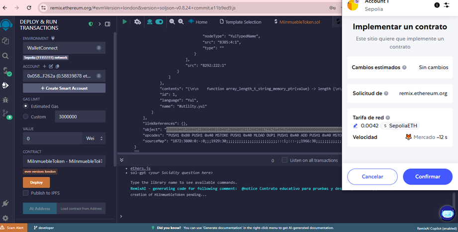
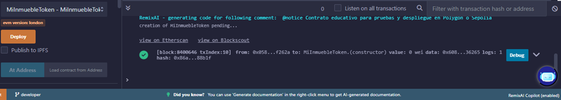

# Desarrollar el contrato ERC20 en Solidity desde la plataforma Remix

>**Entraremos a la plataforma de Remix:
[https://remix.ethereum.org/#](https://remix.ethereum.org/)**

Lo primero es conectarnos a nuestra cuenta de Github para que guarde nuestros proyectos ya que la plataforma no tiene un inicio de sesión.

En el área de trabajo podemos crear un nuevo proyecto utilizando una plantilla predefinida. En la sección derecha Remix nos permite escoger alguna plantilla para empezar a trabajar, en nuestro caso seleccionamos una plantilla en blanco **BLANK**

El IDE de Remix nos crea un área de trabajo y nos genera un solo archivo. 

Creamos un nuevo archivo llamado **MiInmuebleToken.sol** el cual tendrá el código realizado en Solidity.

### Campos del Contrato de Tokenización Inmobiliaria

Este contrato contiene todos los campos clave  desde la descripción del inmueble y sus datos registrales, hasta los valores técnicos para tu token ERC20, como nombre, símbolo y distribución total.

Cada dato ayudará a completar correctamente el smart contract ERC20 y facilitará auditorías, inversiones y confianza en tu proyecto.

En el archivo de Solidity se incluyó la información que se menciona en el contrato firmado y que se encuentra en la red descentralizada a través de **IPFS**:

>**https://gateway.pinata.cloud/ipfs/bafkreiepinhazapereba3g4umwgu3kccf5kl6oj6oa4aalfahjodhu4txy**

### Indica la versión de Solidity que usará Remix. 

>**Importante**: La versión ^0.8.0 protege automáticamente contra errores de desbordamiento (overflow).

>**Tip de seguridad**: Usa siempre una versión actual y estable de Solidity. Evita versiones antiguas como 0.4.x en proyectos reales.**

### Selecciona la versión correcta del compilador

Ve a la pestaña "Solidity Compiler" en Remix (ícono del compilador) y asegúrate de seleccionar:

- Versión del compilador: ^0.8.0 o una específica como 0.8.24

- Activar auto compile: ✔️

- EVM version: London (o alguna común como Berlin, Istanbul, dependiendo de la red que uses)

## Compilar el contrato en Remix IDE
El siguiente paso es compilar el contrato para asegurarte de que no haya errores de sintaxis ni problemas en el código.

Dirígete al panel lateral izquierdo y haz clic en el icono del compilador (generalmente tiene un símbolo de Solidity o de engranaje). Verifica que el archivo **MiInmuebleToken.sol** esté seleccionado.
Haz clic en el botón 'Compile MiInmuebleToken.sol'.

### Archivos generados después de compilar correctamente en Remix IDE
Cuando la compilación de tu contrato es exitosa, Remix IDE genera automáticamente una serie de archivos nuevos dentro de la carpeta artifacts/build-info y en la raíz de la carpeta contracts. Estos archivos son fundamentales para desplegar y verificar tu contrato en la blockchain.

## Desplegar el contrato en la red de pruebas

Antes de desplegar, asegúrate de:

- Tener tu wallet lista y conectada (MetaMask, por ejemplo).

- Estar en la red adecuada (Sepolia, Amoy o mainnet).

- Contar con fondos suficientes para pagar el gas (en testnets puedes usar faucets).

Para desplegar tu contrato en una red de pruebas o en la mainnet usando tu wallet MetaMask, debes seleccionar la opción Injected Provider - MetaMask en el menú de entorno ("ENVIRONMENT") del panel “Deploy & Run Transactions”.

### Autoriza la conexión de MetaMask con Remix IDE
Al seleccionar Injected Provider - MetaMask como entorno de despliegue en Remix IDE, MetaMask abrirá automáticamente una ventana emergente para solicitar tu autorización de conexión.

Verifica que estás conectando la cuenta correcta (por ejemplo, la cuenta ESCUELA con saldo en SepoliaETH).
- Si tienes varias cuentas, puedes editar la selección haciendo clic en "Editar cuentas".
- Haz clic en **Conectar** para permitir que Remix interactúe con tu wallet. Esto es necesario para firmar y pagar las transacciones de despliegue en la red de pruebas o mainnet.

Solo después de conectar, podrás desplegar tu contrato y realizar operaciones en la red seleccionada desde Remix IDE.

### Confirma la transacción en MetaMask para desplegar tu contrato

Al hacer clic en Deploy en Remix IDE, se abrirá automáticamente MetaMask para pedirte que confirmes la transacción de implementación del contrato.

Aquí podrás revisar los detalles, como la tarifa de red (gas) y la cuenta desde la que se enviará la transacción.

Si todo está correcto, haz clic en Confirmar para autorizar el despliegue. En unos segundos, tu contrato estará en proceso de ser desplegado en la blockchain.

Después de confirmar la transacción para desplegar tu contrato, puedes monitorear el estado desde la pestaña “Actividad” de MetaMask.

Aquí verás la implementación de contrato como “Pendiente” hasta que la transacción sea procesada y confirmada en la blockchain.
No cierres Remix IDE ni MetaMask hasta que el proceso se complete.

Si la red está congestionada, puede tardar algunos minutos.

Cuando la transacción de despliegue haya sido procesada exitosamente, MetaMask mostrará el estado como Confirmado en la pestaña de “Actividad”.
Además, en Remix IDE aparecerá un check verde junto a la transacción, indicando que tu contrato ya fue implementado en la blockchain de la red seleccionada.

Revisamos en Metamask el token confirmado: 

Podemos revisar en nuestra billetera o en la red de Sepolia el token confirmado:

Token: **0x1Ef44932eE483339228f1D895621E7D62080E3e8**

## Guía de secciones clave y personalizables en un contrato ERC20

A continuación se explican, una por una, las secciones más importantes que encontrarás al revisar o personalizar tu contrato ERC20.
Incluye consejos sobre si debes o no modificarlas, y recomendaciones de seguridad para evitar errores comunes.

### Versión del compilador
- pragma solidity ^0.8.0;
Indica la versión de Solidity que usará Remix o Hardhat.

Importante: La versión ^0.8.0 protege automáticamente contra errores de desbordamiento (overflow).

**Tip de seguridad**: Usa siempre una versión actual y estable de Solidity. Evita versiones antiguas como 0.4.x en proyectos reales.

(No editable)

### Interfaz ERC20
- interface IERC20

Define la estructura del estándar ERC20, lo que hace que tu token sea reconocido por exchanges, wallets y DApps.

**Tip de seguridad**: No modifiques esta interfaz. Así aseguras compatibilidad con MetaMask, Uniswap y otras herramientas.
(No editable)

### Contrato Owned
- contract Owned

Permite que el contrato tenga un propietario (owner) que puede transferir la propiedad. Controla funciones críticas como recuperar tokens perdidos.

**Tip de seguridad**: Nunca dejes el contrato en manos de una sola persona en proyectos públicos. Considera multisig (ej. Gnosis Safe).
(No editable, solo si quieres cambiar la lógica de propiedad)

### Nombre del token
- string public name = "MiInmuebleToken";

Define el nombre que verán los usuarios en wallets y exploradores.

Editable: Personaliza aquí con el nombre de tu proyecto/token.

**Tip de seguridad**: No uses nombres similares a tokens famosos para evitar confusiones o fraudes.
### Símbolo del token
- string public symbol = "GJIMT";

Es el identificador corto del token (como BTC, ETH, USDT).

Editable: Elige un símbolo único, idealmente de 3 a 5 letras.

**Tip de seguridad**: Evita símbolos confusos o idénticos a otros tokens.
### Número de decimales
- uint8 public decimals = 18;

Define cuántos decimales puede tener tu token. El estándar es 18 (igual que ETH).

Editable: Puedes cambiarlo, pero 18 es el valor más aceptado.

**Tip de seguridad**: No uses 0 a menos que quieras un token indivisible.

### Suministro total (totalSupply)
- uint public override totalSupply

Es la cantidad total de tokens que existirán. Se define típicamente en el constructor, ej: 100 millones con 18 decimales.

Editable: Calcula bien el total: ej. 1 millón = 1_000_000 * 10 ** 18.

**Tip de seguridad**: Un error en este cálculo puede hacer que tu token tenga más o menos unidades de lo que esperas.

### Constructor
- constructor()

Asigna todos los tokens al propietario inicial (usualmente msg.sender). Solo se ejecuta una vez al desplegar.

Opcionalmente editable: Puedes cambiar msg.sender por otra dirección fija si quieres distribuir tokens a otra cuenta.

**Tip de seguridad**: No dejes el supply en una dirección que no controles.

### Funciones principales ERC20
- transfer, approve, transferFrom

Permiten enviar tokens, aprobar a otros y mover tokens con permiso.

No editable: No modifiques estas funciones a menos que seas un desarrollador avanzado.

**Tip de seguridad**: Cambiar estas funciones puede romper la compatibilidad ERC20.

Función de rescate de tokens
transferAnyERC20Token

### Permite al owner recuperar tokens ERC20 enviados por error a este contrato.
- Opcionalmente editable: Úsala solo para soporte técnico y nunca para tomar fondos de otros sin permiso.

**Tip de seguridad**: Es una práctica común, pero informa a tus usuarios de su existencia.
