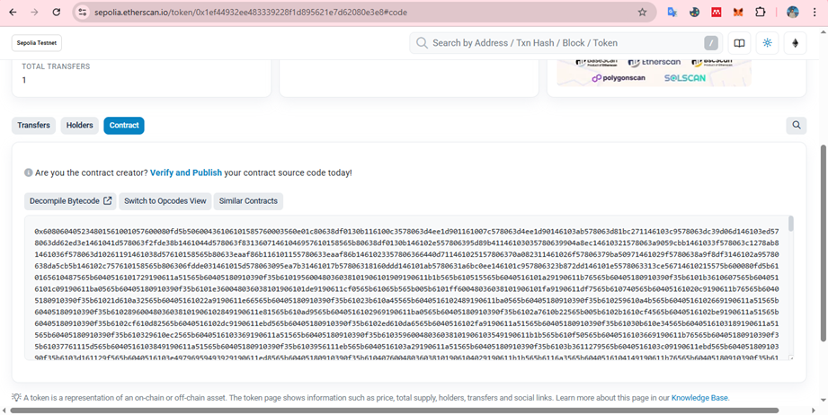
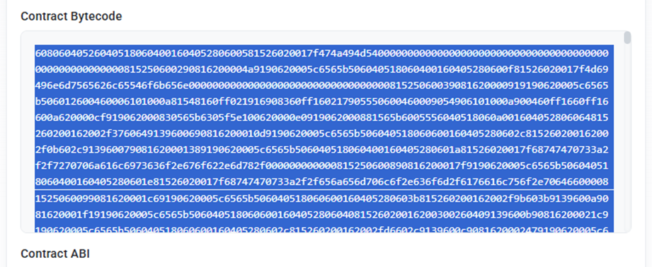

# Publicacióny y verificación del contrato

## Obtención y edición del Bytecode para despliegue

El bytecode es lo que la blockchain realmente ejecuta, por eso debemos obtenerlo y asegurarnos de que esté correcto antes de desplegarlo.

Editar el bytecode te da un control más fino sobre el contrato que vas a subir, especialmente si necesitas hacer ajustes específicos o integrar datos en caliente.

1) En la plataforma Remix haz clic en el botón Compilation Details que aparece en la parte inferior del panel del compilador.

>**Asegúrate de elegir el contrato correcto en el menú desplegable dentro de la pestaña de compilación.**

2) Se abrirá una pestaña con los detalles de compilación. Desplázate hasta encontrar la sección BYTECODE.

3) Ubica el campo object y copia todo el contenido hexadecimal. Este es tu bytecode.

4) Pega el bytecode en un editor y selecciona desde el primer carácter '6' y copia los primeros 40 a 60 caracteres del bytecode.

5) Agrega el prefijo 0x al inicio del fragmento extraído. Esto es necesario para que el bytecode sea reconocido por herramientas como Etherscan.

6) Guarda el archivo con el nombre bytecode-final.txt para usarlo en despliegues manuales.

>****Nota**: Este proceso es ideal para pruebas educativas, despliegues manuales y entender cómo funciona el bytecode. 

## Revisa la transacción confirmada en MetaMask

Después de desplegar tu contrato en la red de Sepolia, puedes verificar que la transacción fue confirmada desde la pestaña Actividad en MetaMask.

Aquí se muestra la implementación de contrato con el estado Confirmado, indicando que el despliegue fue exitoso y que tu contrato ya está activo en la blockchain de Sepolia.

Haz clic sobre la transacción de "Implementación de contrato" que aparece en la pestaña Actividad de MetaMask.
Se abrirá una ventana emergente con el resumen de la transacción: estado, cuentas involucradas, consumo de gas, tarifas y otros detalles.

En esta ventana, tienes dos opciones clave:

Ver en el explorador de bloques: Haz clic en el enlace azul para abrir el explorador de la red (por ejemplo, SepoliaScan) directamente desde MetaMask.

Copiar ID de transacción: Puedes copiar el identificador de la transacción para buscarla manualmente en el explorador si lo prefieres.

Esto te permite validar públicamente en la blockchain que el contrato fue realmente desplegado y consultar su dirección, confirmaciones, y otros datos técnicos.

### Consulta los detalles públicos de tu contrato en el explorador de bloques

Cuando hagas clic en el enlace "Ver en el explorador de bloques" desde MetaMask, se abrirá una nueva pestaña mostrándote el explorador oficial de la red (por ejemplo, SepoliaScan para la red Sepolia).

En esta página podrás ver:

- El **hash de la transacción** y el número de bloque.
- Las direcciones involucradas (“From” y “Interacted With (To)”).
- La **creación del contrato**, incluyendo la dirección final de tu smart contract.
- Los tokens transferidos o creados, la comisión de gas pagada y más detalles técnicos.

Todo esto es público y verificable por cualquier persona, lo que demuestra la transparencia de la blockchain.

En la imagen puedes ver cómo luce la información del contrato recién desplegado en el explorador de Sepolia:

## Cómo verificar tu contrato en el explorador

Antes de interactuar con tu contrato o compartirlo, es fundamental verificar que el despliegue fue exitoso en la blockchain. Esto garantiza que el contrato realmente está activo en la red seleccionada (por ejemplo, Sepolia) y listo para su uso.

Después de desplegar tu contrato, puedes acceder a la dirección del contrato directamente en el explorador de bloques correspondiente (por ejemplo, SepoliaScan o Etherscan).

Aquí podrás ver toda la información pública relacionada al contrato: su dirección, creador, transacciones, saldo y el rastreador del token si aplica.

### Revisa el bytecode desplegado en la pestaña Contract

Haz clic en la pestaña Contract dentro del explorador (SepoliaScan/Etherscan) para acceder a los detalles técnicos del contrato.

Aquí podrás ver el Bytecode (código compilado) que fue cargado en la blockchain. Este es el código que realmente ejecuta la EVM y confirma que tu contrato fue desplegado correctamente.

Si deseas continuar con la verificación del contrato, usa la opción Verify and Publish para subir el código fuente y que otros usuarios puedan auditarlo y consultarlo de forma transparente.

### Inicia el proceso de verificación y publicación del contrato

Haz clic en el enlace Verify and Publish dentro de la pestaña Contract del explorador.
Se abrirá el formulario para verificar y publicar el código fuente de tu contrato.

Aquí debes ingresar la dirección del contrato desplegado (por lo general, se autocompleta), seleccionar el tipo de compilador (Solidity) y la versión exacta utilizada en Remix IDE, así como la licencia de código abierto.

Este paso es fundamental para que cualquier persona pueda consultar el código fuente original y compararlo con el bytecode publicado, lo que incrementa la transparencia y seguridad de tu proyecto.

### Completa los campos de compilador y licencia para la verificación

En el formulario de verificación, selecciona cuidadosamente los siguientes datos:

- Compiler Type: Selecciona "Solidity (Single file)".
- Compiler Version: Elige la versión exacta que utilizaste en Remix IDE.
- Open Source License Type: Escoge la licencia de tu preferencia (por ejemplo, MIT License).

Asegúrate de que la dirección del contrato sea la correcta y acepta los términos del servicio marcando la casilla correspondiente.

Después de revisar que todo esté correcto, haz clic en Continue para avanzar al siguiente paso de la verificación y publicación del código fuente.

### Configuración avanzada y argumentos del constructor

En la sección de configuración avanzada, asegúrate de seleccionar las opciones adecuadas:

- Optimization: Si no usaste optimización al compilar en Remix, deja esta opción en "No".
- Runs (Optimizer): Déjalo como está si no usaste optimización.
- EVM Version to target: Elige "default (compiler defaults)" si no cambiaste esto en Remix.
- License Type: Debe coincidir con la que seleccionaste antes, por ejemplo, "MIT License (MIT)".

En la sección de Constructor Arguments ABI-encoded, deja el campo vacío si tu contrato no requiere argumentos en el constructor (como es típico en muchos ERC20 sencillos).

Si tu contrato requiere parámetros al desplegar, aquí deberás pegarlos en formato ABI codificado.

### Ingresa el código fuente del contrato para verificación

En el siguiente paso, debes pegar el código fuente completo de tu contrato Solidity en el campo correspondiente.
Asegúrate de que el código coincida exactamente con el que compilaste y desplegaste, incluyendo la versión del compilador y la licencia (por ejemplo, MIT).

Este proceso le permite al explorador (SepoliaScan o Etherscan) comparar el bytecode generado y mostrar el contrato como "verificado", permitiendo a cualquier persona revisar su código fuente.

Antes de pegar tu contrato, asegúrate de que el campo para ingresar el código fuente esté completamente vacío.
Esto previene errores de compilación por residuos de código anterior o espacios innecesarios.

Cuando veas el campo vacío como en la imagen, ahora sí puedes pegar el código fuente original de tu contrato Solidity y continuar con el proceso de verificación.

En la imagen puedes ver el campo listo para pegar el código fuente:

Selecciona y copia todo el Bytecode que aparece en la pestaña Contract del explorador de bloques (SepoliaScan/Etherscan).

Este bytecode es la versión compilada de tu contrato y deberás tenerlo listo en caso de necesitar verificar manualmente la equivalencia entre el código fuente y el código desplegado.

Asegúrate de copiarlo completo (puede ser muy largo) y sin espacios extra.

Esto será útil para pasos avanzados de verificación, auditoría o recuperación del contrato en caso de que pierdas acceso al código fuente original.

### Verify and Publish

Después de revisar que todos los campos estén completos, debes marcar la casilla "No soy un robot" para confirmar que no eres un bot automatizado.

Luego, haz clic en el botón azul "Verify and Publish" para enviar la verificación de tu contrato.

Si todo está correcto, el explorador te mostrará un mensaje de éxito y tu contrato quedará verificado públicamente en la blockchain.

### Confirmación de verificación exitosa

Si todo ha sido correcto, el explorador mostrará un mensaje verde indicando que el Bytecode y el ABI coinciden para la dirección del contrato.

Esto significa que tu contrato ha sido verificado y publicado correctamente.

En esta sección también puedes revisar información adicional como:

- El TxHash de la transacción que creó el contrato.
- El resultado del compilador y logs de depuración.

En la imagen puedes ver el mensaje de éxito y los detalles técnicos:

### Revisión del código fuente verificado

Una vez verificado el contrato, el explorador mostrará el código fuente completo del contrato en Solidity.

Este contrato contiene todos los campos clave, desde la descripción del inmueble y sus datos registrales, hasta los valores técnicos para tu token ERC20, como nombre, símbolo y distribución total.

Por ejemplo, podemos revisar el contrato del inmueble desde la red descentralizada:

[https://gateway.pinata.cloud/ipfs/bafkreiepinhazapereba3g4umwgu3kccf5kl6oj6oa4aalfahjodhu4txy](https://gateway.pinata.cloud/ipfs/bafkreiepinhazapereba3g4umwgu3kccf5kl6oj6oa4aalfahjodhu4txy)

Podrás revisar todas las funciones, eventos y variables públicas tal como están en el contrato desplegado.

También se muestran detalles importantes como:

- Nombre del contrato
- Versión del compilador utilizada
- Configuración de optimización y licencia

## Fin del proyecto

Con esto se ha creado un token propio activo, desplegado un contrato inteligente funcional en Ethereum y los fundamentos técnicos y legales para tokenizar valor real desde cero.